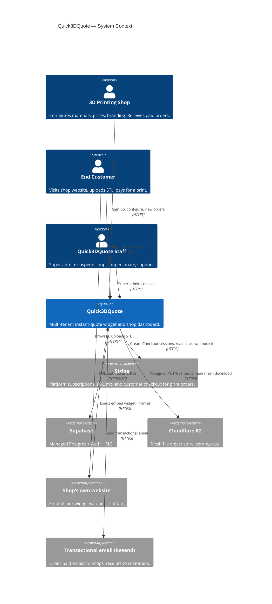
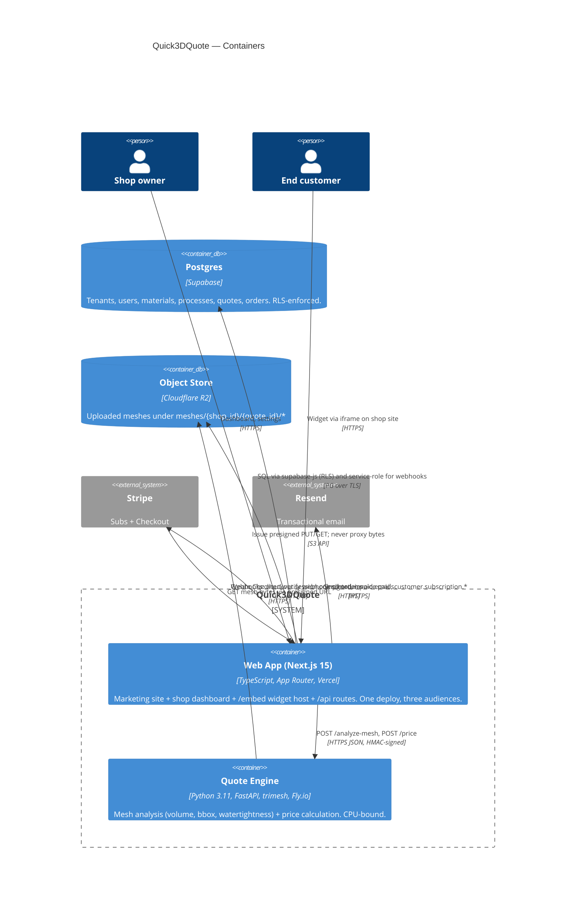

# Quick3DQuote — System Architecture

> Audience: engineers building and operating Quick3DQuote. Assumes the reader has read `CLAUDE.md`. This document is the source of truth for service boundaries, contracts, and scaling posture.

Status: **v1.0 draft** — aligned to MVP scope in `CLAUDE.md` §4. UK spelling throughout.

---

## 1. C4 Context diagram

Who interacts with the system and which third parties we depend on.



---

## 2. C4 Container diagram

Internal containers and the third parties that behave as containers from our POV.



---

## 3. Component responsibilities

### 3.1 Web App (Next.js on Vercel)

**Owns**
- Marketing site, pricing page, auth flows (login/signup via Supabase Auth).
- Shop dashboard: materials CRUD, process settings, branding, embed snippet page, quotes inbox.
- `/embed` route — the iframe-hosted widget (upload + 3D preview + material picker + price + checkout redirect).
- `/embed.js` loader script — the single tag that shops paste onto their site.
- `/api/*` routes: thin BFF that validates input with Zod, enforces auth and tenant scoping, mints presigned R2 URLs, talks to the quote-engine, creates Stripe Checkout sessions, receives Stripe webhooks.
- Super-admin console (gated by `profiles.role = 'superadmin'`).

**Does NOT own**
- Mesh geometry computation. Zero `trimesh`-equivalent code in TypeScript. If we ever parse STLs here it's purely for viewer metadata, not pricing.
- Holding long-running CPU work. Any handler that would exceed ~5s is either (a) pushed to the quote-engine, or (b) deferred.
- Direct writes to tables outside the caller's `shop_id` — enforced by RLS, not just app logic.
- Raw mesh byte storage. Bytes live in R2. The app only ever holds a reference (`mesh_key`).

### 3.2 Quote Engine (FastAPI on Fly.io)

**Owns**
- STL/OBJ/3MF parsing via `trimesh`.
- Deriving: volume (cm³), bounding box (mm), surface area, watertightness flag, triangle count.
- Applying the pricing formula from `CLAUDE.md` §5 against a caller-supplied material+process+qty.
- Returning deterministic, side-effect-free results. Given the same mesh + same inputs, same price.

**Does NOT own**
- Auth. It trusts the Next.js app. Requests are authenticated by an HMAC of the body using a shared secret (`QUOTE_ENGINE_HMAC_SECRET`) plus a timestamp to prevent replay. The engine never talks to Supabase.
- Persistence. It is stateless. No DB, no local disk state beyond the short-lived mesh download.
- Customer or shop identities. It receives opaque IDs for logging only; it never resolves them.
- Stripe, email, or any user-facing concern.

### 3.3 Postgres (Supabase)

**Owns**
- Canonical state: `shops`, `profiles`, `materials`, `processes`, `quotes`, `orders`, `subscriptions`, `audit_log`.
- Multi-tenant isolation via RLS (see `db-schema.md`).
- Row-level `updated_at` triggers and referential integrity.

**Does NOT own**
- Mesh bytes. Only `mesh_key` (R2 object key), `volume_cm3`, `bbox_mm`, `triangle_count`.
- Full Stripe event payloads. We persist only the fields we need (`stripe_customer_id`, `stripe_subscription_id`, `status`); the rest is fetched on demand.

### 3.4 Cloudflare R2

**Owns**
- All uploaded mesh bytes, keyed `meshes/{shop_id}/{quote_id}/{original_filename}`.
- Versioning disabled — meshes are immutable per `quote_id`.

**Does NOT own**
- Indexing, querying, or metadata beyond what the key path encodes. Anything queryable lives in Postgres.

### 3.5 Stripe

**Owns**
- Shop subscription billing (£50/mo).
- Customer one-off Checkout for print orders.
- Payment method vaulting.

**Does NOT own**
- Order fulfilment state. We mirror `paid` → `in_production` → `shipped` in our own `orders.status`. Stripe is the truth for *payment*, not for *the order*.

---

## 4. Data flow walkthroughs

### 4.1 Customer uploads STL, sees price, pays, shop sees order

1. **Widget load.** Shop's site has `<script src="https://quick3dquote.com/embed.js?key=SHOP_KEY"></script>`. That script injects an iframe at `https://quick3dquote.com/embed?key=SHOP_KEY`. The iframe is same-origin with our app, so no CORS gymnastics.
2. **Bootstrap.** Iframe calls `GET /api/embed/bootstrap?key=SHOP_KEY`. Server looks up `shops.embed_key = SHOP_KEY`, returns: shop branding, active materials, active processes. This endpoint is unauthenticated but rate-limited per `shop_key` and per IP. No price or cost internals leak — only customer-facing fields.
3. **File upload.** Customer drops `part.stl` (say 12 MB). Widget calls `POST /api/uploads/presign` with `{ shop_key, filename, size, mime }`. Server validates size/ext, creates a pending `quotes` row (`status='draft'`, `shop_id` resolved from the key), returns a presigned R2 PUT URL scoped to `meshes/{shop_id}/{quote_id}/part.stl` valid for 10 minutes. The browser `PUT`s the bytes directly to R2 — **bytes never transit our servers**.
4. **Analyse.** Browser calls `POST /api/quotes/{id}/analyze`. Next.js handler generates a presigned GET URL for the mesh, HMAC-signs a body `{ quote_id, mesh_url, ts }`, and calls the quote-engine at `POST /analyze-mesh`. Engine streams the mesh from R2, runs `trimesh`, returns `{ volume_cm3, bbox_mm, triangle_count, watertight, analysis_ms }`. Next.js persists these on the `quotes` row.
5. **Render preview.** Widget loads the mesh directly from R2 via a short-lived presigned GET (separate from the engine's) and renders with react-three-fiber. Dimensions overlay reads from the analyse response, not the client-side parse (engine is the source of truth).
6. **Price.** Customer picks material, colour, qty. Widget calls `POST /api/quotes/{id}/price` with `{ material_id, qty }`. Next.js loads the material/process rows (RLS bypassed via service role because the caller is unauthenticated — but scoped to the quote's `shop_id`), POSTs `{ volume_cm3, material, process, qty }` to the engine's `POST /price`. Engine applies the formula and returns `{ unit_price, total, breakdown }`. Next.js caches this on `quotes.price_cache` keyed by `(material_id, qty)` so subsequent identical requests skip the engine round-trip.
7. **Capture contact.** Customer enters email + phone. Widget calls `PATCH /api/quotes/{id}` to persist.
8. **Checkout.** Widget calls `POST /api/quotes/{id}/checkout`. Next.js creates a Stripe Checkout session **on the shop's Stripe account** (direct-to-shop per `CLAUDE.md` §11), with `success_url` and `cancel_url` on our domain. We pass `metadata.quote_id`. Response is the Checkout URL; widget redirects top-level (breaks out of iframe via `window.top.location`).
9. **Pay.** Customer pays on Stripe-hosted page.
10. **Webhook.** Stripe POSTs `checkout.session.completed` to `/api/webhooks/stripe`. Handler verifies the signature using the endpoint secret, looks up the quote by `metadata.quote_id`, transitions it `quotes.status='paid'`, creates an `orders` row, and enqueues an email to the shop via Resend. The email contains the order summary and a signed R2 GET URL for the mesh, 24h TTL.
11. **Shop sees it.** Shop's dashboard polls `/api/orders` (or subscribes via Supabase Realtime — nice-to-have, not MVP-blocking). The new order appears with `status='paid'`.

What's stored where at the end: mesh bytes in R2; quote + order rows in Postgres; payment in Stripe; email record in Resend.

### 4.2 Shop signs up and subscribes to £50/mo

1. Shop visits `quick3dquote.com/signup`, enters email + password. Supabase Auth creates the user. We auto-create a `shops` row with the user as owner and generate `embed_key` (random 24-char).
2. App redirects to `/onboarding/billing`. Page calls `POST /api/billing/checkout` which creates a Stripe Checkout session in **subscription** mode for the £50/mo price, `customer_email` pre-filled, `metadata.shop_id` set, `success_url=/onboarding/done`, `cancel_url=/onboarding/billing`.
3. Shop completes card entry on Stripe.
4. Stripe fires `checkout.session.completed` then `customer.subscription.created` to our webhook. We upsert a `subscriptions` row `{shop_id, stripe_subscription_id, status='active', current_period_end}`.
5. A middleware on dashboard routes checks `subscriptions.status` — without `active` or `trialing`, shop is bounced to `/onboarding/billing`. This is the entitlement gate.
6. Subsequent monthly charges fire `invoice.paid` (renew) or `invoice.payment_failed` (→ we mark `past_due`, email the shop, soft-disable the widget after a grace period by returning HTTP 402 on `/api/embed/bootstrap` for that shop_key).

### 4.3 Shop edits a material and customer reprices the same mesh

1. Shop opens dashboard, edits `PLA` from £0.08/cm³ to £0.10/cm³. Dashboard calls `PATCH /api/materials/{id}`. Row is updated under RLS. We bump `shops.materials_version` (a monotonic counter) so any cached bootstrap response can be invalidated.
2. Separately, a returning customer opens the widget with a quote already in hand (say we've given them a "save your quote" link — v1.1; in MVP they'd reupload). For MVP the flow is: customer reuploads the same STL. New `quote_id`, new R2 key, re-run analyse. Volume is the same (deterministic), so after the engine call the quote lands with the same `volume_cm3`. Price is calculated against the new material row → **new price reflects the edit**.
3. Note on cache safety: the `price_cache` on the quote is keyed by `(material_id, qty)`. If the material row's `updated_at` changes, we include `material.updated_at` in the cache key, so an edit invalidates the cache automatically. We do NOT retroactively reprice already-paid orders — those are frozen at purchase.

---

## 5. Service boundaries & contracts

### 5.1 Why the quote-engine is a separate service

Three reasons, in descending order of importance:

1. **Python-only libraries.** `trimesh` has no credible JS equivalent. `three-stdlib`'s STL parser is for rendering, not geometric analysis — it won't give us a watertight volume. Rewriting `trimesh` in TS is a multi-month tarpit and we'd still lag on correctness.
2. **CPU-bound work doesn't belong in Vercel lambdas.** Parsing a 50 MB mesh takes 200 ms–2 s on a warm CPU. Vercel functions are priced and limited for burst I/O, not sustained CPU; we'd blow budgets and hit the 60 s hard cap on larger files.
3. **Cold starts.** FastAPI on a warm Fly.io machine responds in <50 ms. A Python cold start on serverless is 2–5 s — unacceptable when the product promise is "instant quote."

Keeping the engine stateless, HMAC-auth'd, and behind a narrow HTTP contract means we can replace it (Rust + `meshopt`, Go + a FFI, anything) without touching the Next.js side.

### 5.2 HTTP contract

Base URL: `https://engine.quick3dquote.internal` (private Fly.io network + public fallback for CI).
Auth: every request carries `X-Signature: hmac-sha256=<hex>` over `"{timestamp}.{body}"` and `X-Timestamp: <unix_ms>`. Requests older than 300s are rejected.

#### POST /analyze-mesh

Request:
```json
{
  "quote_id": "q_01HXYZ...",
  "mesh_url": "https://<r2-presigned-get>",
  "max_bytes": 104857600
}
```

Response 200:
```json
{
  "quote_id": "q_01HXYZ...",
  "volume_cm3": 47.318,
  "surface_area_cm2": 184.9,
  "bbox_mm": { "x": 62.1, "y": 41.0, "z": 28.7 },
  "triangle_count": 41208,
  "watertight": true,
  "units_detected": "mm",
  "analysis_ms": 312
}
```

Errors:
- `400 invalid_mesh` — parse failed.
- `413 too_large` — exceeds `max_bytes`.
- `422 non_manifold` — analysis succeeded but geometry unsuitable for pricing (surfaced to user as "we couldn't analyse this file, try exporting as solid").
- `502 upstream_fetch_failed` — R2 fetch failed.

#### POST /price

Request:
```json
{
  "quote_id": "q_01HXYZ...",
  "volume_cm3": 47.318,
  "qty": 3,
  "material": {
    "id": "m_01...",
    "price_per_cm3": 0.10,
    "density_g_cm3": 1.24
  },
  "process": {
    "id": "p_01...",
    "throughput_cm3_per_hour": 12.0,
    "hourly_rate": 4.50,
    "setup_fee": 3.00,
    "min_order": 8.00,
    "markup_pct": 0.20
  }
}
```

Response 200:
```json
{
  "quote_id": "q_01HXYZ...",
  "unit_price": 10.46,
  "total": 31.39,
  "breakdown": {
    "material_cost": 4.73,
    "print_hours": 3.943,
    "machine_cost": 17.74,
    "setup_cost": 3.00,
    "subtotal_per_part": 25.47,
    "markup_applied": 5.09,
    "min_order_applied": false
  },
  "currency": "GBP"
}
```

Pricing is pure — no DB hit, no network beyond the HMAC check. Target p95 < 20 ms.

---

## 6. Build vs buy decisions

**Supabase vs Auth0 + RDS.** Supabase collapses managed Postgres, auth, and RLS into one bill. RLS is the killer feature for multi-tenant B2B: tenant isolation lives in the database, so an app bug can't leak another shop's data. Auth0 + RDS costs more at our scale (Auth0's free tier ends fast with social login at volume), needs two dashboards, and still leaves you implementing RLS yourself.

**Cloudflare R2 vs S3.** Mesh files are 5–200 MB, downloaded by viewer and shop. Egress is the cost that bites. At 10k shops × 500 paid prints/mo × 50 MB × 3 downloads ≈ 75 TB/mo egress — ~£6k/mo on S3, zero on R2. Same S3-compatible API, same presigned URL model, swap cost is low.

**Stripe Checkout vs custom PSP.** We need PCI scope zero. Stripe Checkout is hosted — card data never touches our origin, so we stay in SAQ A. A custom flow drags in SAQ A-EP, compliance reviews, and audit burden. The product differentiator is instant-quote UX, not checkout UX. We also get Apple Pay, Google Pay, Link, and EU SCA handling for free.

**Vercel vs self-host.** Vercel is the path of least resistance for Next.js 15 App Router: edge middleware, image optimisation, PR preview URLs, zero-config SSR/ISR. Self-hosting saves 20–30% at scale but demands someone owning the build pipeline, CDN invalidation, and cert renewal. Until we have a platform engineer, Vercel's opinions are worth the premium. The app is a plain Next.js build, portable to any Node host in a day.

---

## 7. Scaling plan

Bottlenecks appear in this order. Numbers are order-of-magnitude, not promises.

**10 shops (~5k quotes/mo, ~500 paid).** No bottleneck. Single Fly.io `shared-cpu-1x` engine. Supabase starter, Vercel Hobby+. Under £100/mo all-in.

**100 shops (~50k quotes/mo).** First pressure points:
- Engine CPU spikes on 100 MB+ meshes cause pile-up. **Action:** 2–3 Fly.io machines, concurrency cap 4 per machine, in-process semaphore with 30 s timeout.
- Supabase connection count — Vercel serverless can exhaust the 60-conn cap. **Action:** enable Supavisor transaction-mode pooling on API routes.

**1,000 shops (~500k quotes/mo).**
- **Engine throughput** becomes the headline axis. ~0.2 RPS average, spiky to 5–10 RPS peak. **Action:** 5–10 Fly.io machines behind anycast LB; `lhr` primary with `iad` failover.
- **R2 storage** grows to ~5 TB. **Action:** lifecycle rule — meshes > 30 days → Infrequent Access, delete at 90 days unless referenced by a non-cancelled order.
- **Stripe webhooks** — 100k+ events/mo, risk is 10 s endpoint timeouts. **Action:** handler does signature-verify + enqueue only; processing in a background job (Vercel Cron + `webhook_events`, idempotent by `event.id`).
- **Next.js cold starts.** **Action:** move hot paths (`/api/embed/bootstrap`, `/price`) to Edge runtime; Stripe webhook stays Node (raw-body verification).

**10,000 shops (~5M quotes/mo, real business).**
- **Supabase** — single writer. Move to dedicated compute tier, or split `quotes` into its own DB with a pointer from main. Read replicas for dashboard queries.
- **Engine cost** is material (£k/mo). **Action:** in-memory LRU of `(mesh_hash, material_id, qty) → price`; consider a Rust rewrite of volume integration if CPU cost outweighs eng cost.
- **R2 egress** — still zero.
- **Multi-region** — engine in `lhr` + `iad` + `syd`; DB stays single-region (see non-goals).

Summary: quote-engine CPU is the first-to-bite, Supabase connections second, webhook-processing throughput third, DB write capacity last.

---

## 8. Failure modes & graceful degradation

**Quote-engine down (Fly outage, bad deploy).** The widget must not break. Fallback: `/api/quotes/*/analyze` returns 503 with `{ fallback: "request_quote", reason: "engine_unavailable" }`. Widget switches to "Request a quote" mode — customer enters email, mesh stays in R2, quote is created with `status='awaiting_manual_price'`, shop gets an email to price manually. We lose instant-quote UX for that session; we don't lose the lead.

**R2 down.** Upload presign returns 503. Widget shows "File upload temporarily unavailable." No failover — R2 is on the hot path. R2's 99.9% SLA is acceptable risk at MVP. We alert on R2 5xx rate via Cloudflare analytics.

**Stripe webhook down or our handler down.** Stripe retries for 3 days with exponential backoff; no events lost. Handler is idempotent keyed by `stripe_event.id` in `webhook_events`. We page on webhook-error-rate > 1% for 5 min. A super-admin replay tool can re-ingest any event by ID.

**Supabase Postgres down.** App is effectively down — dashboard 5xx, embed bootstrap fails. Single-point-of-failure we accept for MVP; Supabase's 99.9% SLA implies ~45 min/mo allowable downtime. Incident response, not active-active failover.

**Stripe down.** New payments can't be taken. Widget shows "Payment provider unavailable." Existing paid orders remain accessible.

**Presigned URL forgery / replay.** HMAC on engine calls prevents it. R2 URLs are scoped by key path and TTL'd: 10 min upload / 24 h download. A stolen URL grants one mesh for its TTL, not system access.

---

## 9. Observability

SLIs we commit to and the tools that emit them.

**Logs.**
- Vercel logs for the Next.js app (request-level, structured JSON via `pino`). Retention 7 days on Pro, we forward to Axiom for 30-day retention and cross-service search.
- Fly.io logs for the engine (`structlog` JSON). Also forwarded to Axiom.
- Supabase logs for Postgres — query logs, RLS denials (critical for catching tenant-scoping bugs in development).

**Metrics.**
- Vercel Web Analytics for basic page timings.
- Custom metrics via OpenTelemetry → Axiom for the SLIs below.
- Fly.io built-in metrics (CPU, memory, restart count) with PagerDuty hooks.

**Traces.**
- OpenTelemetry spans across `embed → /api/* → quote-engine`. Propagated `traceparent` header through the HMAC'd boundary. A slow price call should be diagnosable from a single trace ID.

**Errors.**
- Sentry on both Next.js and FastAPI. Release tagging from CI. We pay attention to error-rate regressions per release.

**Product analytics.**
- PostHog (self-hosted later if privacy demands it). Events: `widget_loaded`, `mesh_uploaded`, `mesh_analysed`, `price_rendered`, `checkout_clicked`, `checkout_completed`. Per-shop funnel is the single most useful view we own — it tells a shop's success manager why conversion is 12% not 30%.

**SLIs that matter.**
| SLI | Target | Why |
|---|---|---|
| Quote price latency p95 (upload-complete → price-shown) | < 3 s | Product promise. |
| `/price` engine p95 | < 50 ms | Detects engine regression before users do. |
| Widget error rate (client-side JS errors / sessions) | < 0.5% | Embedding on unknown host pages is unforgiving. |
| Webhook processing success rate | > 99.5% | Below this, orders silently drop. |
| Dashboard page p95 | < 1.5 s | Brand perception. |
| Embed bootstrap p95 | < 300 ms | Every shop visitor hits this. |

Alerting: any SLI breach for 10 min → Slack `#alerts`. Webhook success < 95% for 5 min → PagerDuty.

---

## 10. Explicit non-goals

We are **not** building architectural support for:

1. **On-prem / self-hosted.** No air-gapped install, no customer-hosted engine, no Docker-compose "run it yourself" option. If a shop requires it, they're not our customer.
2. **Multi-region active-active.** Primary region is `lhr` (eu-west). We may add read-only edges later, but write path stays single-region. The engineering cost of multi-master Postgres is not justified by our latency budget (customers tolerate 300 ms of geo-latency for a quote).
3. **Real-time collaboration.** Shops don't collaborate on a quote. No CRDTs, no WebSocket state sync beyond optional Supabase Realtime for dashboard inbox refresh.
4. **Public API for shops.** Shops get a widget. If they want programmatic access they can wait for v1.x; designing the public surface now would constrain our internal refactors.
5. **White-label custom domains for the widget.** Widget lives at `quick3dquote.com/embed`, always. Custom-domain CNAME + TLS provisioning is a rabbit-hole we don't need.
6. **True slicer-accurate print-time.** See `CLAUDE.md` §3 deferred. The architecture supports swapping the engine internals later, but we don't provision CuraEngine capacity now.
7. **STEP / IGES support.** Would require OCCT in the engine container — out of MVP.
8. **GDPR data-residency guarantees beyond "EU region."** We process EU data in EU regions, we don't certify for specific-country residency.
9. **Offline / PWA support for the widget.** It requires server round-trips to price. Offline is a false promise here.
10. **Multi-user shops with roles.** `shop_id` is 1:1 with a user in v1. Teams, RBAC, audit-log-per-user are deferred — the schema leaves room (`profiles.role`) but the UI and policies don't exist.

---

*End of architecture.md. Changes to service boundaries or third-party choices must update `CLAUDE.md` §3 and this document in the same PR.*
