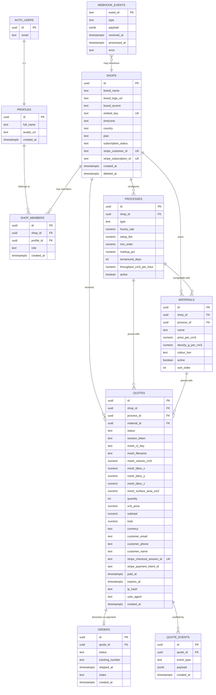

# Quick3DQuote — Database Schema

> Postgres (Supabase) schema for the multi-tenant instant-quote SaaS. Tenant = `shops`. RLS is the only thing standing between Shop A and Shop B; every table is guilty until proven innocent.
>
> Conventions: `uuid` PKs (`gen_random_uuid()`), `timestamptz` everywhere with `default now()`, `snake_case`, soft-delete via `deleted_at` where retention matters, ISO-4217 3-letter currency, ISO-3166-1 alpha-2 country. All money stored as `numeric(12,2)` — never `float`.

---

## 1. ER diagram



---

## 2. Table-by-table DDL

All DDL targets Postgres 15 (Supabase default). Assumes `pgcrypto` for `gen_random_uuid()` and `citext` for case-insensitive email. Both are in Supabase's default extensions.

### 2.1 `profiles`

One row per authenticated user. Mirrors `auth.users` so we can safely JOIN and attach profile data without poking the auth schema.

```sql
create extension if not exists pgcrypto;
create extension if not exists citext;

create table public.profiles (
    id          uuid primary key references auth.users(id) on delete cascade,
    full_name   text,
    avatar_url  text,
    created_at  timestamptz not null default now(),
    updated_at  timestamptz not null default now()
);

comment on table public.profiles is 'Per-user profile. PK = auth.users.id.';
```

A trigger on `auth.users` insert creates the `profiles` row (see §6).

### 2.2 `shops`

The tenant. One shop per paying customer in v1.

```sql
create table public.shops (
    id                      uuid primary key default gen_random_uuid(),
    brand_name              text        not null check (length(brand_name) between 1 and 120),
    brand_logo_url          text,
    brand_accent            text        not null default '#0F172A'
                             check (brand_accent ~ '^#[0-9A-Fa-f]{6}$'),
    embed_key               text        not null unique
                             check (length(embed_key) between 24 and 64),
    timezone                text        not null default 'Europe/London',
    country                 char(2)     not null default 'GB',
    plan                    text        not null default 'starter'
                             check (plan in ('starter','pro','scale')),
    subscription_status     text        not null default 'incomplete'
                             check (subscription_status in (
                                'incomplete','trialing','active','past_due',
                                'canceled','unpaid','paused'
                             )),
    stripe_customer_id      text        unique,
    stripe_subscription_id  text        unique,
    created_at              timestamptz not null default now(),
    updated_at              timestamptz not null default now(),
    deleted_at              timestamptz
);

comment on column public.shops.embed_key is
    'Public token embedded in the widget <script>. Read-only from anon role.';
```

`embed_key` is public (appears in customer site HTML) so it must not be the row PK. Rotatable by re-issuing.

### 2.3 `shop_members`

Models the user↔shop relationship now so v1.1 multi-user support is a no-op migration. In v1 we enforce one row per profile via a unique constraint.

```sql
create table public.shop_members (
    id          uuid primary key default gen_random_uuid(),
    shop_id     uuid not null references public.shops(id)     on delete cascade,
    profile_id  uuid not null references public.profiles(id)  on delete cascade,
    role        text not null default 'owner'
                check (role in ('owner','admin','member')),
    created_at  timestamptz not null default now(),
    unique (shop_id, profile_id),
    unique (profile_id)              -- drop this in v1.1 to allow multi-shop membership
);

create index idx_shop_members_shop_id on public.shop_members(shop_id);
```

### 2.4 `processes`

FDM / SLA per shop. Shops can have multiple of the same type (e.g. two FDM printer profiles).

```sql
create table public.processes (
    id                         uuid primary key default gen_random_uuid(),
    shop_id                    uuid not null references public.shops(id) on delete cascade,
    type                       text not null check (type in ('fdm','sla','sls','mjf')),
    name                       text not null,
    hourly_rate                numeric(10,2) not null check (hourly_rate >= 0),
    setup_fee                  numeric(10,2) not null default 0 check (setup_fee >= 0),
    min_order                  numeric(10,2) not null default 0 check (min_order >= 0),
    markup_pct                 numeric(5,2)  not null default 0 check (markup_pct >= 0 and markup_pct <= 500),
    turnaround_days            int           not null default 5 check (turnaround_days between 0 and 90),
    throughput_cm3_per_hour    numeric(8,2)  not null check (throughput_cm3_per_hour > 0),
    active                     boolean       not null default true,
    created_at                 timestamptz   not null default now(),
    updated_at                 timestamptz   not null default now()
);

create index idx_processes_shop_active on public.processes(shop_id) where active;
```

### 2.5 `materials`

```sql
create table public.materials (
    id                 uuid primary key default gen_random_uuid(),
    shop_id            uuid not null references public.shops(id)     on delete cascade,
    process_id         uuid not null references public.processes(id) on delete restrict,
    name               text not null check (length(name) between 1 and 80),
    price_per_cm3      numeric(10,4) not null check (price_per_cm3 >= 0),
    density_g_per_cm3  numeric(6,3)  not null check (density_g_per_cm3 > 0),
    colour_hex         text not null check (colour_hex ~ '^#[0-9A-Fa-f]{6}$'),
    active             boolean not null default true,
    sort_order         int     not null default 100,
    created_at         timestamptz not null default now(),
    updated_at         timestamptz not null default now(),
    constraint materials_shop_process_match
        check (shop_id is not null and process_id is not null)
);

-- Ensure process belongs to same shop (enforced by FK + trigger below,
-- because Postgres can't express cross-column FK integrity natively).
create or replace function public.assert_material_process_same_shop()
returns trigger language plpgsql as $$
begin
    if not exists (
        select 1 from public.processes p
        where p.id = new.process_id and p.shop_id = new.shop_id
    ) then
        raise exception 'process % does not belong to shop %', new.process_id, new.shop_id;
    end if;
    return new;
end $$;

create trigger trg_materials_same_shop
before insert or update on public.materials
for each row execute function public.assert_material_process_same_shop();

create index idx_materials_shop_active on public.materials(shop_id, sort_order) where active;
create index idx_materials_process_id  on public.materials(process_id);
```

### 2.6 `quotes`

The hot table. Every widget upload creates a row.

```sql
create table public.quotes (
    id                          uuid primary key default gen_random_uuid(),
    shop_id                     uuid not null references public.shops(id)     on delete cascade,
    process_id                  uuid references public.processes(id)          on delete set null,
    material_id                 uuid references public.materials(id)          on delete set null,
    status                      text not null default 'draft'
                                check (status in (
                                    'draft','priced','checkout_started',
                                    'paid','failed','expired','cancelled'
                                )),
    session_token               text not null unique
                                check (length(session_token) = 43), -- 32-byte base64url
    mesh_r2_key                 text,
    mesh_filename               text,
    mesh_volume_cm3             numeric(14,4) check (mesh_volume_cm3 is null or mesh_volume_cm3 > 0),
    mesh_bbox_x                 numeric(10,3),
    mesh_bbox_y                 numeric(10,3),
    mesh_bbox_z                 numeric(10,3),
    mesh_surface_area_cm2       numeric(14,3),
    quantity                    int not null default 1 check (quantity between 1 and 10000),
    unit_price                  numeric(12,2),
    subtotal                    numeric(12,2),
    total                       numeric(12,2),
    currency                    char(3) not null default 'GBP' check (currency ~ '^[A-Z]{3}$'),
    customer_email              citext,
    customer_phone              text,
    customer_name               text,
    stripe_checkout_session_id  text unique,
    stripe_payment_intent_id    text,
    paid_at                     timestamptz,
    expires_at                  timestamptz not null default (now() + interval '7 days'),
    ip_hash                     text,            -- sha256(ip + daily_salt)
    user_agent                  text,
    created_at                  timestamptz not null default now(),
    updated_at                  timestamptz not null default now(),

    constraint quotes_paid_requires_intent
        check (status <> 'paid' or stripe_payment_intent_id is not null),
    constraint quotes_priced_requires_total
        check (status not in ('priced','checkout_started','paid') or total is not null)
);

comment on column public.quotes.session_token is
    'Ephemeral secret issued to widget on quote creation. Anon role reads/updates
     rows by (id + session_token) match only.';
```

### 2.7 `orders`

Post-payment lifecycle. A quote becomes an order when Stripe confirms. Kept as a separate table (not a view) so fulfilment state and shipping data have their own audit trail without bloating `quotes`.

```sql
create table public.orders (
    id               uuid primary key default gen_random_uuid(),
    quote_id         uuid not null unique references public.quotes(id) on delete restrict,
    status           text not null default 'in_production'
                     check (status in (
                        'in_production','ready_to_ship','shipped',
                        'delivered','cancelled','refunded'
                     )),
    tracking_number  text,
    carrier          text,
    shipped_at       timestamptz,
    delivered_at     timestamptz,
    notes            text,
    created_at       timestamptz not null default now(),
    updated_at       timestamptz not null default now()
);

create index idx_orders_status on public.orders(status);
```

### 2.8 `quote_events`

Append-only audit log. Every state change goes here with a JSONB payload.

```sql
create table public.quote_events (
    id           uuid primary key default gen_random_uuid(),
    quote_id     uuid not null references public.quotes(id) on delete cascade,
    event_type   text not null check (event_type in (
                    'created','priced','checkout_started',
                    'paid','failed','shop_viewed','shop_status_changed',
                    'refund_requested','refunded','expired'
                 )),
    actor        text not null default 'system'
                 check (actor in ('system','shop','customer','stripe','admin')),
    payload      jsonb not null default '{}'::jsonb,
    created_at   timestamptz not null default now()
);

create index idx_quote_events_quote_created on public.quote_events(quote_id, created_at desc);

-- Enforce immutability at the DB level.
create or replace function public.quote_events_immutable()
returns trigger language plpgsql as $$
begin
    raise exception 'quote_events rows are immutable';
end $$;

create trigger trg_quote_events_no_update
before update or delete on public.quote_events
for each row execute function public.quote_events_immutable();
```

### 2.9 `webhook_events`

Stripe idempotency. Primary key is the Stripe event id.

```sql
create table public.webhook_events (
    event_id      text primary key,            -- evt_...
    type          text not null,
    payload       jsonb not null,
    received_at   timestamptz not null default now(),
    processed_at  timestamptz,
    error         text
);

create index idx_webhook_events_unprocessed
    on public.webhook_events(received_at)
    where processed_at is null;
```

Webhook handler: `insert ... on conflict (event_id) do nothing returning event_id`. If nothing returned, we've seen it. If returned, process and `update ... set processed_at = now()`.

### 2.10 Rate limits — **use Upstash Redis, not Postgres**

Recommendation: **do not put rate-limit state in Postgres**. Every widget boot, every price call, every checkout start would write-amplify the primary DB and erode the connection pool. Use Upstash Redis with the `@upstash/ratelimit` sliding-window algorithm, keyed on `embed_key:<shop>` and `ip:<hash>`.

If Redis is deferred past MVP, this is the stop-gap table. Fine for <10 rps per shop; rip it out at scale.

```sql
create table public.api_rate_limits (
    bucket_key    text        not null,        -- e.g. 'embed:SHOPKEY:60s'
    window_start  timestamptz not null,
    hits          int         not null default 1,
    primary key (bucket_key, window_start)
);

create index idx_rate_limits_cleanup on public.api_rate_limits(window_start);
-- Cron job nukes rows older than 1h.
```

---

## 3. Indexes (rationale)

```sql
-- Shop dashboard: list quotes for a shop, newest first, filter by status.
create index idx_quotes_shop_created       on public.quotes(shop_id, created_at desc);
create index idx_quotes_shop_status_created
    on public.quotes(shop_id, status, created_at desc);

-- Webhook handler: find quote by Stripe checkout session id.
-- (Already indexed by the UNIQUE constraint, restated for clarity.)
-- create unique index ... on public.quotes(stripe_checkout_session_id);

-- Widget boot: resolve shop from embed_key. UNIQUE already covers it.
-- create unique index ... on public.shops(embed_key);

-- Customer-email lookups in shop dashboard (rare but indexed for support).
create index idx_quotes_customer_email on public.quotes(customer_email)
    where customer_email is not null;

-- Usage metering: count paid quotes this month per shop.
create index idx_quotes_shop_paid_at on public.quotes(shop_id, paid_at desc)
    where paid_at is not null;

-- Expiry sweeper.
create index idx_quotes_expires_open
    on public.quotes(expires_at)
    where status in ('draft','priced','checkout_started');
```

Notes:

- **Partial indexes** carry their weight here — `paid_at is not null` and `active` filters keep index pages small.
- Foreign keys get explicit indexes (`idx_processes_shop_active`, `idx_materials_shop_active`, `idx_materials_process_id`, `idx_shop_members_shop_id`). An un-indexed FK turns every parent-side delete into a seq scan.
- No index on `quotes.shop_id` alone — `idx_quotes_shop_created` covers it for all `shop_id =` predicates.

---

## 4. Row Level Security

RLS on every tenant-scoped table. Default deny.

### 4.1 Helpers

```sql
-- Current user's shop_id (fast, cached per-statement).
create or replace function public.current_shop_id()
returns uuid
language sql
stable
security definer
set search_path = public
as $$
    select sm.shop_id
    from public.shop_members sm
    where sm.profile_id = auth.uid()
    limit 1
$$;
```

`security definer` here is fine — the function takes no input and leaks no data beyond the caller's own membership.

### 4.2 `profiles`

```sql
alter table public.profiles enable row level security;

create policy profiles_self_read on public.profiles
    for select using (id = auth.uid());

create policy profiles_self_update on public.profiles
    for update using (id = auth.uid()) with check (id = auth.uid());
```

### 4.3 `shops`

```sql
alter table public.shops enable row level security;

-- Members can read their own shop.
create policy shops_member_read on public.shops
    for select using (id = public.current_shop_id());

-- Only owners can update the shop row.
create policy shops_owner_update on public.shops
    for update using (
        exists (
            select 1 from public.shop_members sm
            where sm.shop_id = shops.id
              and sm.profile_id = auth.uid()
              and sm.role = 'owner'
        )
    );

-- Anon role: read a minimal projection of shop by embed_key (widget boot).
-- We restrict to only the columns the widget needs via a view (see §4.8).
```

No `delete` policy: shop deletion is a privileged server-side operation only.

### 4.4 `shop_members`, `processes`, `materials`

All three follow the same shape: scope by `current_shop_id()`.

```sql
alter table public.shop_members enable row level security;
create policy shop_members_member_read on public.shop_members
    for select using (shop_id = public.current_shop_id());

alter table public.processes enable row level security;
create policy processes_rw on public.processes
    for all using (shop_id = public.current_shop_id())
            with check (shop_id = public.current_shop_id());

alter table public.materials enable row level security;
create policy materials_rw on public.materials
    for all using (shop_id = public.current_shop_id())
            with check (shop_id = public.current_shop_id());
```

### 4.5 `quotes` — the interesting one

Three roles touch `quotes`: **authenticated shop users**, **anon widget customers**, and **service_role** (webhooks).

**Shop owner policy (authenticated):**

```sql
alter table public.quotes enable row level security;

create policy quotes_shop_read on public.quotes
    for select using (shop_id = public.current_shop_id());

create policy quotes_shop_update on public.quotes
    for update using (shop_id = public.current_shop_id())
               with check (shop_id = public.current_shop_id());
-- Shops cannot insert quotes directly — only the widget / API can.
```

**Anonymous widget — the tricky pattern.**

The widget is unauthenticated but must:

1. `insert` a new quote against a shop (identified by `embed_key`).
2. `select`/`update` only that one quote on subsequent calls.

We solve it with a **per-quote session token** issued on creation and carried in an HTTP header (`X-Quote-Session`). Postgres sees it via a request-scoped GUC set by the API layer with `set_config('request.quote_session', $1, true)`.

```sql
-- Insert: anon may insert a quote ONLY if the shop_id matches a known embed_key.
-- We force this through a SECURITY DEFINER RPC, not a raw policy, so that anon
-- never writes shop_id directly.

create or replace function public.create_quote_from_widget(
    p_embed_key    text,
    p_filename     text,
    p_user_agent   text,
    p_ip_hash      text
) returns table (quote_id uuid, session_token text)
language plpgsql
security definer
set search_path = public
as $$
declare
    v_shop_id uuid;
    v_token   text := encode(gen_random_bytes(32), 'base64');
    v_id      uuid;
begin
    -- Strip base64 padding so length = 43 per CHECK constraint.
    v_token := replace(replace(rtrim(v_token, '='), '+', '-'), '/', '_');

    select id into v_shop_id from public.shops
        where embed_key = p_embed_key
          and deleted_at is null
          and subscription_status in ('active','trialing','past_due');

    if v_shop_id is null then
        raise exception 'invalid embed key' using errcode = '42501';
    end if;

    insert into public.quotes (shop_id, session_token, mesh_filename, user_agent, ip_hash, status)
    values (v_shop_id, v_token, p_filename, p_user_agent, p_ip_hash, 'draft')
    returning id into v_id;

    insert into public.quote_events (quote_id, event_type, actor, payload)
    values (v_id, 'created', 'customer', jsonb_build_object('ip_hash', p_ip_hash));

    return query select v_id, v_token;
end $$;

revoke all on function public.create_quote_from_widget(text,text,text,text) from public;
grant execute on function public.create_quote_from_widget(text,text,text,text) to anon;
```

Anon's read/update is then gated by the session token GUC:

```sql
create policy quotes_widget_read on public.quotes
    for select
    to anon
    using (
        session_token = current_setting('request.quote_session', true)
        and status not in ('cancelled','expired')
        and expires_at > now()
    );

create policy quotes_widget_update on public.quotes
    for update
    to anon
    using (
        session_token = current_setting('request.quote_session', true)
        and status in ('draft','priced')
        and expires_at > now()
    )
    with check (
        session_token = current_setting('request.quote_session', true)
        and status in ('draft','priced','checkout_started')
    );
```

What anon **can** do via this pattern:
- Create a quote for a valid `embed_key` (via RPC only).
- Read/update **their own** quote row by presenting `session_token`.

What anon **cannot** do:
- Read any other quote, material price list, process config, or shop field not exposed by a dedicated view.
- Insert directly into `quotes` (no `INSERT` policy for `anon`).
- Mutate `status = 'paid'` or set `paid_at` — enforced by `with check` excluding those states; only service_role sets them.

### 4.6 `orders`

```sql
alter table public.orders enable row level security;

create policy orders_shop_rw on public.orders
    for all
    using (
        exists (
            select 1 from public.quotes q
            where q.id = orders.quote_id
              and q.shop_id = public.current_shop_id()
        )
    )
    with check (
        exists (
            select 1 from public.quotes q
            where q.id = orders.quote_id
              and q.shop_id = public.current_shop_id()
        )
    );
```

### 4.7 `quote_events`, `webhook_events`, `api_rate_limits`

```sql
alter table public.quote_events enable row level security;
create policy quote_events_shop_read on public.quote_events
    for select
    using (
        exists (
            select 1 from public.quotes q
            where q.id = quote_events.quote_id
              and q.shop_id = public.current_shop_id()
        )
    );
-- No insert/update/delete policies: only SECURITY DEFINER functions write here.

alter table public.webhook_events enable row level security;
-- No policies at all. Only service_role (which bypasses RLS) touches this table.

alter table public.api_rate_limits enable row level security;
-- Service role only.
```

### 4.8 Public widget view

For widget boot the anon role needs *some* shop data (brand, accent, logo). Expose a tight view, not the table:

```sql
create or replace view public.shop_public as
    select id, brand_name, brand_logo_url, brand_accent, country, embed_key
    from public.shops
    where deleted_at is null
      and subscription_status in ('active','trialing');

grant select on public.shop_public to anon;
```

Views honour the underlying table's RLS in Postgres 15+ **only when invoked with `security_invoker = on`**. Set it:

```sql
alter view public.shop_public set (security_invoker = on);
```

Then add a permissive policy for anon on `shops` restricted to the view's projection safety (or run the view as `security_definer` with a tight WHERE clause — belt-and-braces).

---

## 5. Enums

**Recommendation: use `text` + `check` constraints, not Postgres `ENUM` types.**

Why:

- Adding a value to a native `enum` requires `ALTER TYPE ... ADD VALUE`, which cannot run inside a transaction in older Postgres and cannot be reordered or removed easily.
- `check (status in (...))` is trivially mutable via a migration (`drop constraint; add constraint`) and plays nicely with ORMs and Zod schemas that already hold the source-of-truth list.
- Storage cost is negligible — all our enums are short.

The check-constrained domains we use:

| Column | Allowed values |
|---|---|
| `quote_status` | `draft`, `priced`, `checkout_started`, `paid`, `failed`, `expired`, `cancelled` |
| `order_status` | `in_production`, `ready_to_ship`, `shipped`, `delivered`, `cancelled`, `refunded` |
| `process_type` | `fdm`, `sla`, `sls`, `mjf` |
| `subscription_status` | `incomplete`, `trialing`, `active`, `past_due`, `canceled`, `unpaid`, `paused` (mirrors Stripe) |

The TypeScript side exports the same lists from a single `enums.ts` file; both sides pull from it for validation.

---

## 6. Migrations strategy

Supabase CLI (`supabase db diff`, `supabase migration new`). All DDL lives under `supabase/migrations/` and is version-controlled.

**Naming:** `YYYYMMDDHHMMSS_snake_case_description.sql`. Example: `20260421_103000_add_quotes_table.sql`. The CLI enforces this.

**Process:**

1. Branch: `feat/db-add-materials-sort-order`.
2. `supabase migration new add_materials_sort_order`.
3. Edit the generated file. Always include a reversible block where practical:
   ```sql
   -- Up
   alter table public.materials add column sort_order int not null default 100;
   -- No automatic down migration file, but a matching rollback is in docs/runbooks/.
   ```
4. `supabase db reset` locally to confirm the full chain applies cleanly from scratch.
5. Run the seed (§8) and smoke-test the widget.
6. PR → CI runs `supabase db reset` on an ephemeral instance → merge.
7. Production apply is `supabase db push` from the deploy job, never manual.

**RLS policy changes** are the highest-risk class of migration. Rules:

- Never `drop policy` and `create policy` in two separate transactions in prod — do both in one migration file so there is never a moment when the table has RLS enabled but no policies (which silently denies everything).
- Add new policies before dropping old ones when widening access.
- Run `select * from pg_policies where schemaname = 'public'` in CI as a snapshot test; diff against a golden file in the repo. Any unexpected policy change fails the build.
- For sensitive changes, wrap in `begin; ... commit;` and test against a clone with `pg_dump --data-only` restored.

**Trigger trail:** add a trigger that mirrors inserts on `auth.users` into `public.profiles`:

```sql
create or replace function public.handle_new_user()
returns trigger language plpgsql security definer set search_path = public as $$
begin
    insert into public.profiles (id) values (new.id)
    on conflict (id) do nothing;
    return new;
end $$;

create trigger trg_auth_user_created
after insert on auth.users
for each row execute function public.handle_new_user();
```

---

## 7. Data retention

**When a shop cancels** (`subscription_status = 'canceled'`):

- Mark `shops.deleted_at = now()`. Do not hard-delete.
- A scheduled job runs daily and, for shops with `deleted_at < now() - interval '30 days'`:
  - Issues R2 `DeleteObjects` for all keys under `meshes/{shop_id}/`.
  - Clears `quotes.mesh_r2_key`, `mesh_filename`, `customer_email`, `customer_phone`, `customer_name`, `ip_hash`, `user_agent` on every quote for that shop (the rows remain for our own financial records but contain no customer PII).
  - Orders are preserved as aggregate rows only.
- At `deleted_at < now() - interval '365 days'`, the shop row and all dependent rows are hard-deleted (UK company-records rule: we keep financial records for 6 years on the app level, but the shop is past our retention for their *customers'* data).

**GDPR Subject Access Request** (a customer asking a shop for their data):

- Flow is shop-initiated: dashboard has a "Data request" action per quote that exports a JSON file (quote, mesh metadata, fulfilment status, event log) and optionally issues a signed R2 URL for the original mesh.
- **Right to erasure**: shop clicks "Erase customer data" on the quote. Endpoint runs a SECURITY DEFINER function that: nullifies PII columns on the quote, appends a `quote_events` row with `event_type = 'customer_erasure'`, deletes the R2 object, and returns a confirmation receipt.
- We store a `customer_erased_at timestamptz` column (add in a follow-up migration) to prove erasure occurred for audit.

**Soft vs hard delete matrix:**

| Table | Policy |
|---|---|
| `shops` | Soft (30d file purge, 365d hard delete) |
| `quotes` | Never hard-deleted by user action; PII-nullified on shop cancel or SAR erasure |
| `quote_events` | Append-only forever (immutable trigger enforces) |
| `webhook_events` | Trimmed after 90 days (cron); historic audit only |
| `orders` | Never deleted; fulfilment history is a business record |
| `materials`, `processes` | Soft via `active = false`; hard-delete allowed if unreferenced |

---

## 8. Seed data

One demo shop, one owner user, both FDM and SLA processes, four materials. Placed at `supabase/seed.sql`.

```sql
-- supabase/seed.sql
-- Idempotent: safe to run repeatedly via supabase db reset.

insert into auth.users (id, email, email_confirmed_at, raw_user_meta_data)
values (
    '00000000-0000-0000-0000-000000000001',
    'demo@quick3dquote.test',
    now(),
    jsonb_build_object('full_name', 'Demo Owner')
) on conflict (id) do nothing;

insert into public.profiles (id, full_name)
values ('00000000-0000-0000-0000-000000000001', 'Demo Owner')
on conflict (id) do nothing;

insert into public.shops (id, brand_name, embed_key, brand_accent, country, plan, subscription_status)
values (
    '11111111-1111-1111-1111-111111111111',
    'Demo Print Co',
    'demo_embed_key_abcdef0123456789abcdef01',
    '#FF6B35',
    'GB',
    'starter',
    'active'
) on conflict (id) do nothing;

insert into public.shop_members (shop_id, profile_id, role)
values (
    '11111111-1111-1111-1111-111111111111',
    '00000000-0000-0000-0000-000000000001',
    'owner'
) on conflict (shop_id, profile_id) do nothing;

-- Processes
with p_fdm as (
    insert into public.processes
        (id, shop_id, type, name, hourly_rate, setup_fee, min_order,
         markup_pct, turnaround_days, throughput_cm3_per_hour)
    values (
        '22222222-2222-2222-2222-222222222221',
        '11111111-1111-1111-1111-111111111111',
        'fdm', 'FDM Default', 3.50, 2.00, 10.00, 25.00, 5, 12.00
    ) on conflict (id) do nothing
    returning id
),
p_sla as (
    insert into public.processes
        (id, shop_id, type, name, hourly_rate, setup_fee, min_order,
         markup_pct, turnaround_days, throughput_cm3_per_hour)
    values (
        '22222222-2222-2222-2222-222222222222',
        '11111111-1111-1111-1111-111111111111',
        'sla', 'SLA Default', 6.00, 3.00, 15.00, 35.00, 7, 18.00
    ) on conflict (id) do nothing
    returning id
)
select 1;

-- Materials (2 FDM, 2 SLA)
insert into public.materials
    (shop_id, process_id, name, price_per_cm3, density_g_per_cm3, colour_hex, sort_order)
values
    ('11111111-1111-1111-1111-111111111111',
     '22222222-2222-2222-2222-222222222221',
     'PLA Black',   0.08, 1.240, '#111111', 10),
    ('11111111-1111-1111-1111-111111111111',
     '22222222-2222-2222-2222-222222222221',
     'PETG White',  0.11, 1.270, '#F5F5F5', 20),
    ('11111111-1111-1111-1111-111111111111',
     '22222222-2222-2222-2222-222222222222',
     'Standard Resin Grey', 0.22, 1.180, '#808080', 10),
    ('11111111-1111-1111-1111-111111111111',
     '22222222-2222-2222-2222-222222222222',
     'Tough Resin Clear',   0.35, 1.150, '#EAEAEA', 20)
on conflict do nothing;
```

With that, hitting the widget at `/embed?key=demo_embed_key_abcdef0123456789abcdef01` works on a fresh dev DB.

---

## 9. Query patterns

The six queries that will run most. All shown as Supabase JS for the app side and raw SQL for the server/webhook side.

### 9.1 List quotes for shop (dashboard)

```ts
const { data, error } = await supabase
    .from('quotes')
    .select(`
        id, status, total, currency, customer_email,
        mesh_filename, created_at, paid_at,
        material:materials(name, colour_hex),
        process:processes(type, name)
    `)
    .order('created_at', { ascending: false })
    .range(0, 49);
// RLS does the shop_id filtering. Index: idx_quotes_shop_created.
```

### 9.2 Get quote by id (shop owner view)

```ts
const { data } = await supabase
    .from('quotes')
    .select('*, material:materials(*), process:processes(*), order:orders(*)')
    .eq('id', quoteId)
    .maybeSingle();
```

### 9.3 Create quote from widget (anon, RLS-bypass pattern)

```ts
// API route running as anon, after rate-limit check:
const { data, error } = await supabase.rpc('create_quote_from_widget', {
    p_embed_key:  embedKey,
    p_filename:   filename,
    p_user_agent: req.headers.get('user-agent') ?? '',
    p_ip_hash:    ipHash,
});
// data = [{ quote_id, session_token }]
// Return session_token as an httpOnly cookie scoped to the embed origin.
```

### 9.4 Update quote to paid on webhook (service_role)

```sql
-- In the Stripe webhook handler, connected as service_role (bypasses RLS).
with upd as (
    update public.quotes
       set status = 'paid',
           paid_at = now(),
           stripe_payment_intent_id = $1,
           updated_at = now()
     where stripe_checkout_session_id = $2
       and status in ('checkout_started','priced')
    returning id, shop_id
)
insert into public.orders (quote_id)
select id from upd
on conflict (quote_id) do nothing
returning id;
```

Plus an event row:

```sql
insert into public.quote_events (quote_id, event_type, actor, payload)
select id, 'paid', 'stripe',
       jsonb_build_object('payment_intent', $1, 'session', $2)
from public.quotes where stripe_checkout_session_id = $2;
```

### 9.5 List materials for shop (widget, via RPC)

Because anon must not read the full `materials` table (RLS blocks it) we expose a read-only RPC that takes the `embed_key`:

```sql
create or replace function public.list_materials_for_embed(p_embed_key text)
returns table (
    id uuid, process_id uuid, process_type text,
    name text, price_per_cm3 numeric, density_g_per_cm3 numeric,
    colour_hex text, sort_order int
)
language sql stable security definer set search_path = public as $$
    select m.id, m.process_id, pr.type,
           m.name, m.price_per_cm3, m.density_g_per_cm3,
           m.colour_hex, m.sort_order
    from public.materials m
    join public.processes pr on pr.id = m.process_id
    join public.shops s      on s.id  = m.shop_id
    where s.embed_key = p_embed_key
      and s.deleted_at is null
      and s.subscription_status in ('active','trialing')
      and m.active and pr.active
    order by m.sort_order, m.name;
$$;
grant execute on function public.list_materials_for_embed(text) to anon;
```

### 9.6 Count paid quotes this month (usage metering)

```sql
select count(*) as paid_this_month
from public.quotes
where shop_id = $1
  and paid_at >= date_trunc('month', now() at time zone 'UTC')
  and paid_at <  date_trunc('month', now() at time zone 'UTC') + interval '1 month';
-- Index: idx_quotes_shop_paid_at.
```

---

## 10. Risks & footguns

1. **`service_role` key leakage.** The service-role JWT bypasses RLS entirely. Rules:
   - Never ship it to the browser. Ever.
   - Only the Stripe webhook handler and the nightly retention job use it. Everything else goes through anon or authenticated keys.
   - Rotate on any suspected leak via the Supabase dashboard. Set a CI check that greps the web bundle for the service-role JWT prefix.

2. **`SECURITY DEFINER` functions are a trust boundary.** `create_quote_from_widget`, `list_materials_for_embed`, etc. run with definer privileges. Review each one for:
   - Explicit `set search_path = public` (prevents function-hijacking via malicious schemas).
   - No unsanitised text-to-SQL concatenation.
   - A `revoke all ... from public` before the targeted `grant execute ... to anon`.

3. **Connection-pool exhaustion.** Supabase's pooler in transaction mode caps at ~200 connections on the entry tier. Every serverless Next.js invocation that opens a direct Postgres connection eats one. Rules:
   - App uses the Supabase JS client over PostgREST — pooled at the edge, not per-connection.
   - Anything Python-side (quote-engine) connects via the **Supavisor transaction pooler** (port 6543), never directly to 5432.
   - Long-running jobs (nightly retention, metering) use a separate pool with a hard connection cap of 5.

4. **Do not store mesh files in Postgres.** An STL can be 5–200MB. A `bytea` column at that size turns every quote read into TOAST fetch pain, blows up pg_dump backups, and makes RLS meaningless because we'll be tempted to `select *`. **Files live in R2.** The DB holds only `mesh_r2_key`. This is non-negotiable.

5. **RLS on views.** Pre-15 and even on 15 by default, a view runs as the definer and ignores the caller's RLS. Always set `security_invoker = on` on tenant-scoped views, or the view becomes a backdoor.

6. **The `anon` session-token pattern depends on transport.** If the `X-Quote-Session` header is set from untrusted JS on a compromised customer site, a malicious actor could read a specific quote they own. Mitigations: token is 32 bytes of random, never logged, and expires with `quotes.expires_at`. Also: the widget runs in a same-origin iframe on `quick3dquote.com`, so customer-site JS cannot reach it.

7. **Stripe webhook replay.** Without `webhook_events` idempotency, a Stripe retry could double-insert an order. The `insert ... on conflict (event_id) do nothing` pattern plus the `orders.quote_id` unique constraint make double-processing structurally impossible.

8. **Enum drift between app and DB.** Because we chose check constraints over native enums, TypeScript and Postgres can diverge silently. Mitigation: a CI test queries `information_schema.check_constraints` and asserts the allowed values equal the TS source-of-truth array.

9. **`ON DELETE CASCADE` on `shops`.** Deleting a shop row cascades to *every* quote, material, order, and event. In practice we never hard-delete shops — soft-delete only. The cascade is there as a safety net for admin use and for `auth.users` tombstone sync.

10. **Timezone traps.** `created_at` is `timestamptz` (UTC under the hood), but reports should respect `shops.timezone`. All date-bucket queries must `at time zone shops.timezone` — don't trust the server's `TZ`.

---

*End of schema document. Reviewed against CLAUDE.md §5 (pricing engine) and §6 (multi-tenancy). No scope creep introduced; deferred items (multi-user shops, Stripe Connect, STEP support) noted in the relevant tables but not implemented.*

Path: `C:/Users/Olly/Git/3d Printing Software/docs/db-schema.md` — word count: 4,916 (wc -w, including SQL/DDL tokens).
