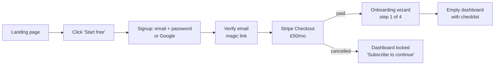
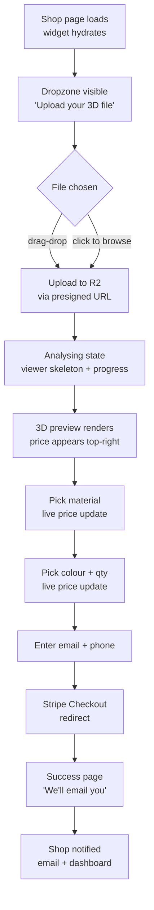
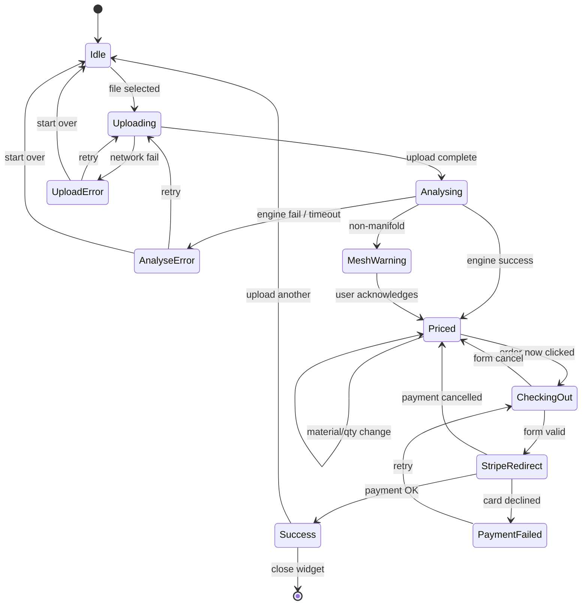

# Quick3DQuote — UX Flows

> Owner: UX Researcher agent. Source doc for all flow-level decisions across the shop dashboard and the embedded customer widget. UK English. Last updated 2026-04-21.

Two personas sit either side of the product:

- **Shop Owner** — a paying customer (£50/mo). Small 3D-printing business, probably technical, wants fewer quote emails and more paid orders. Lives in the dashboard for five minutes a day.
- **End Customer** — the shop's visitor. Has an STL from Fusion, Blender, a download site, or their boss. May have never bought a 3D print before. Lives in the widget for two minutes once.

The shop owner pays us because the end customer's experience converts. That's the whole product.

---

## 1. Flow principles

Six rules that govern every screen.

1. **Price in under two seconds.** From "file dropped" to "a number on screen" must feel instant. If the engine is slow, we render the viewer first and stream price in behind it. Never make the customer wait with nothing to look at.
2. **Never blank screen.** Every transition has a skeleton, a shimmer, a progress bar, or the previous state greyed-out. A white screen is a conversion killer. A "loading" screen that shows *the thing becoming real* (viewer fading in, dimensions populating) feels faster even when it's the same wall-clock time.
3. **Assume the customer has never heard of STL.** No jargon in the customer widget. "Upload your 3D file" not "Upload your mesh". "Millimetres" not "mm" on first reference. Tooltips, not modals, for anything that might confuse.
4. **Show the price, always.** The price is the headline. It lives top-right of the widget from the moment upload finishes and updates visibly on every change. If we're recalculating, we don't hide it — we dim it and show a micro-spinner next to it.
5. **Errors are part of the flow, not interruptions.** Non-manifold mesh? Price it anyway and show an amber warning. File too big? Offer to compress. Upload failed? One-tap retry, don't send them back to the start. Hard-blocks only when we genuinely cannot proceed.
6. **Trust signals at every money moment.** Lock icon by the Stripe redirect. "Powered by Stripe" under the checkout button. Shop's own logo at the top of the widget at all times — the customer is buying from *their* shop, not from us.

---

## 2. Shop Owner flows

### 2.1 Signup → subscribe → first dashboard



**States and copy:**

- **Post-signup, pre-Stripe.** Full-screen card: *"One more step — activate your shop for £50/mo. Cancel anytime, no trial faff."* Single primary button to Stripe Checkout. No alternative path: they must subscribe to access the dashboard. This is deliberate per the MVP spec (no trial in v1).
- **Stripe cancel/abandon.** Return URL lands on a holding screen: *"No charge made. Ready when you are."* with a single button back to Checkout. Do not log them out.
- **Stripe success.** Webhook flips `shops.subscription_status = active`, we redirect to `/onboarding/1`.

### 2.2 Onboarding wizard (4 steps, skippable after step 2)

The dashboard is hostile without configuration — no materials = no widget. So we gate the embed snippet behind a minimum viable setup: **one material + one process**.

**Step 1 — Shop identity.**
Fields: shop name, logo upload (optional, default generated from initials), accent colour (default: slate blue #3B5BDB). Live preview of how the widget header will look, right-hand side of screen. One click away from "Looks good, next".

**Step 2 — First material.**
We pre-fill one sensible default and let them edit. Copy: *"Add your first material. You can add more in a minute — this just gets you moving."*

Smart defaults with two starter presets they can pick from:

| Field | FDM PLA preset | SLA Standard Resin preset |
|---|---|---|
| Name | PLA (Standard) | Standard Grey Resin |
| Process | FDM | SLA |
| £/cm³ | 0.08 | 0.22 |
| Density (g/cm³) | 1.24 | 1.15 |
| Colour (hex) | #1E1E1E | #808080 |
| Active | yes | yes |

Tooltip next to £/cm³: *"Your cost plus margin on the raw material, per cubic centimetre. A 20g PLA benchy costs you roughly 20p in plastic — so £0.08/cm³ is a typical retail rate."*

**Step 3 — Process settings.**
Two tabs (FDM / SLA), each with the same fields. Defaults:

| Field | FDM default | SLA default |
|---|---|---|
| Hourly rate (£) | 4.50 | 6.00 |
| Setup fee (£) | 3.00 | 5.00 |
| Minimum order (£) | 8.00 | 12.00 |
| Markup (%) | 30 | 25 |
| Turnaround (days) | 3 | 5 |
| Throughput (cm³/hr) | 12 | 18 |

The throughput field is hidden behind an "Advanced" disclosure — most shops won't touch it. Copy above the form: *"These are sensible starting numbers. You can always tune them once you've seen how your real prints price up."*

**Step 4 — Grab your snippet.**
One big code block with a copy button. Instructions below for each platform.

```html
<script src="https://quick3dquote.com/embed.js?key=SHOP_KEY_HERE" async></script>
<div id="quick3dquote"></div>
```

Platform-specific notes, each collapsible:

- **WordPress** — *"Use a Custom HTML block on the page or post where you want the widget. Paste both lines. Save. Preview."*
- **Shopify** — *"Theme → Edit code → open the template you want (usually `page.liquid`). Paste both lines where the widget should appear. Save."*
- **Webflow** — *"Add an Embed element to the page, paste both lines, save, publish."*
- **Raw HTML** — *"Paste anywhere inside the `<body>` tag. The widget fills the parent container, so wrap it in a div with whatever max-width you'd like."*

Finish button → empty dashboard.

### 2.3 Empty-state dashboard

Top-level nav: **Quotes** (default), **Materials**, **Processes**, **Branding**, **Embed**, **Settings**.

First load, Quotes tab is empty. The empty state does real work:

- Headline: **"No quotes yet."**
- Subhead: *"Once a customer uploads a file on your site, it'll appear here. Takes about ninety seconds from file to paid order."*
- Checklist (tick as done):
  - [x] Shop set up
  - [x] First material added
  - [x] First process configured
  - [ ] Widget embedded on your site — *[View snippet]*
  - [ ] Test order (upload a file on your own site to check it works)
- Secondary CTA: *"Not sure it's working? [Open my widget in a new tab](link)"* — gives them a fully functional test instance at `quick3dquote.com/preview/SHOP_KEY`.

### 2.4 Incoming quote / paid order

The **Quotes** tab is a table (newest first). Columns: date, customer, material, qty, total, status, actions.

Status chips (colour-coded):
- `Quoted` (grey) — price shown, not paid
- `Paid` (green) — Stripe payment complete, file available
- `In production` (blue) — shop has clicked "start"
- `Shipped` (purple) — shop has marked shipped
- `Cancelled` (neutral)

Clicking a row opens a slide-over panel on the right. Contents:

- 3D preview of the uploaded file (same viewer as the widget)
- Dimensions and volume (computed at quote time, cached)
- Customer name, email, phone
- Material, colour, quantity, unit price, total
- Stripe payment ID + link
- **Download file** button (signed R2 URL, 24h TTL)
- Action buttons: `Mark in production`, `Mark shipped`, `Refund`
- Timeline / audit log at the bottom

Actions are optimistic — clicking `Mark shipped` flips the chip immediately, and if the API fails we toast *"Couldn't save — try again"* and revert.

### 2.5 Cancel subscription

Settings → Billing → `Cancel subscription`. Confirmation modal:

- Headline: **"Cancel your Quick3DQuote subscription?"**
- Body: *"Your widget will keep working until the end of your current billing period ([date]). After that, the widget stops accepting uploads on your site. Your quote history stays available for 90 days so you can export anything you need."*
- Two buttons: `Keep subscription` (primary) and `Cancel anyway` (secondary, destructive colour).

After confirming, a toast: *"Cancelled. You're paid up until [date]."* We fire `subscription_cancelled` and route them to an optional one-question exit survey (*"What made you cancel?"* — radio list, skip-able).

---

## 3. End Customer flows

This is the flow that earns the money. Every extra second, every extra click costs the shop orders.

### 3.1 Happy path



### 3.2 Land on page, pre-upload

The widget loads inside an iframe on the shop's page. First paint shows the shop's logo and accent colour at the top, then a full-width dropzone:

- Large icon (upload arrow, not an STL cube — customers don't know what that is)
- Headline: **"Upload your 3D file"**
- Subhead: *"STL, OBJ or 3MF — up to 100MB. Drop it here or [choose a file]."*
- Below: *"No 3D file? [Here's how to export one from Fusion, Blender or TinkerCAD.](link)"* — opens a short help modal, not an external redirect.

### 3.3 Upload + analyse

The instant a file is selected we kick off three things in parallel:

1. Request a presigned R2 URL from our API.
2. Show the analysing state.
3. Begin upload.

**Analysing state UI:**

- The dropzone fades to a centred card with a determinate progress bar for the upload (0–100%), then an indeterminate shimmer while the engine computes.
- A skeleton of the 3D viewer sits in the background, same dimensions as the final viewer — so nothing jumps when it populates.
- Copy under the progress bar: *"Uploading your file..."* → *"Reading the geometry..."* → *"Working out the price..."*
- If the whole process takes longer than 4 seconds, we add: *"Big file? Hang tight, we're nearly there."*

When the engine returns, we cross-fade the skeleton into the real viewer and slide the price card in from the top-right. That animation is ~250ms — enough to register, not enough to feel slow.

### 3.4 3D preview interactions

The viewer takes ~60% of the widget height on desktop. Controls:

- **Rotate** — click-drag (mouse), one-finger drag (touch). Orbit around the centroid.
- **Zoom** — scroll (mouse), pinch (touch). Clamped to sensible min/max.
- **Reset view** — small icon button bottom-right of the viewer: rotates back to iso, zooms to fit.
- **Dimensions** — always-visible overlay top-left of the viewer: *"120 × 80 × 45 mm · 38.2 cm³"*. UK decimal convention. Not interactive in v1.
- **Wall-thinness warning** — if trimesh flags regions under 1.2mm for FDM or 0.6mm for SLA, a small amber chip appears: *"Some walls may be too thin to print reliably. [Learn more]"*. The quote still generates.

The viewer has a subtle grid floor to give scale context — a 3D model floating in black space doesn't read as "a physical thing a shop will make".

### 3.5 Material, colour, quantity

Below the viewer, in the right-hand pane on desktop / stacked on mobile:

- **Material** — dropdown or horizontal chip row if there are ≤4 active materials. Shows name and process tag: "PLA (FDM)", "Tough Resin (SLA)".
- **Colour** — swatches pulled from the selected material's available colours. If only one colour, the control collapses into a read-only line ("Colour: Black").
- **Quantity** — stepper (− 1 +), min 1, max 100. Typing allowed.
- **Turnaround estimate** — shown as a caption: *"Ready in about 3 working days"*.

Every change recomputes the price client-side (we cache the volume; pricing is arithmetic so it's instant). The price card has a 120ms fade-and-number-tick animation so the change is visible but not jarring.

### 3.6 Email, phone, checkout

Primary CTA at the bottom: **Order now — £34.20** (total in the button itself).

Clicking expands an inline form (doesn't navigate away):

- Email (required, validated inline)
- Phone (required, for production queries — captioned *"We'll only call if there's a question about your print"*)
- Optional note (expandable): *"Anything we should know? (e.g. orientation preferences)"*
- Consent line: *"By placing this order you agree to [Shop's] terms. Payment handled securely by Stripe."*

Submit button: **Continue to payment →**

Handoff to Stripe Checkout (shop's Stripe account — direct charge per the CLAUDE.md default). Success URL returns to the widget, cancel URL returns to the widget with order form preserved.

### 3.7 Success

Full-widget success state:

- Tick icon
- Headline: **"Order placed. Thank you."**
- Body: *"We've emailed a confirmation to [email]. [Shop name] will get in touch within [turnaround] working days. Your order reference is `Q-7F2A9C`."*
- Secondary: small link *"Upload another file"* for customers who have multiple parts.

Backend: Stripe webhook flips the quote to `paid`, sends the shop an email, creates the dashboard entry with download link.

### 3.8 Error cases

- **Unsupported file type.** Block at browser level (accept attribute + JS check). Toast: *"We support STL, OBJ and 3MF files. That looks like a [.xyz] — can you re-export?"*
- **File too large (>100MB).** Check before upload starts. Message: *"That file's [Xmb] — our limit is 100MB. Try decimating the mesh in Blender or your slicer. [Need help?](link)"*
- **Upload fails midway.** Retry UI, not a full restart: *"Upload interrupted. [Try again]"*. The file handle is preserved so they don't re-pick.
- **Non-manifold / broken mesh.** Engine returns volume with a `warnings` array. We still show the price but add an amber banner above the viewer: *"This file has some small geometry issues — we can still print it, but the result might vary slightly from the preview. [What does this mean?](link)"*
- **Engine timeout (>30s).** Treat as soft error: *"Taking longer than expected. [Retry] or [Request a manual quote]"*. Manual quote falls back to emailing the shop with the file reference.
- **Zero volume / empty mesh.** Hard-block: *"We couldn't find any solid geometry in that file. Is it a sketch or a surface rather than a solid? [Export tips]"*.

---

## 4. Edge-case microcopy

UK English, friendly but direct. No exclamation marks unless genuinely celebratory.

| Moment | Copy |
|---|---|
| First empty dashboard | **No quotes yet.** Once a customer uploads a file on your site, it'll land here. Most shops see their first order within a day of embedding the widget. |
| Upload error (generic) | **That didn't work.** The upload stopped before we got the whole file. [Try again] — we've kept your selection. |
| Price is loading | **Working out the price...** Reading the geometry, factoring in material and machine time. A few seconds. |
| Quote expired (24h old) | **This quote's a bit old.** Prices can shift if we've updated materials since. [Refresh price] to check, or [start over] with a new file. |
| Stripe checkout failed | **Payment didn't go through.** Your card wasn't charged. [Try again] or use a different card — we use Stripe, so we never see your card details. |
| Widget on an unsubscribed shop | **This quoter is paused.** The shop's setting things up — please check back shortly, or [email them](mailto:shop@example.com) directly. |
| Non-manifold mesh warning | **Heads up: some small geometry issues.** We can still quote and print this, but the final part might differ slightly from the preview. Most files are fine — this just means your CAD export has a few loose edges. |
| Mobile viewer tip on first load | **Drag to rotate, pinch to zoom.** [Got it] |

---

## 5. Widget state diagram



---

## 6. Accessibility

The 3D viewer is inherently pointer/gesture-based and cannot be fully keyboard-driven in v1. Everything else must be. WCAG 2.1 AA is the minimum bar.

**Keyboard path for the full quote flow:**

1. `Tab` into the widget — focus lands on the dropzone (role=button, aria-label="Upload a 3D file").
2. `Enter` or `Space` opens the file picker.
3. After upload, focus moves to the material dropdown (announced via aria-live: *"File uploaded. Price: £34.20. Choose a material."*).
4. `Tab` through: material → colour → quantity stepper → email → phone → note → Order now button.
5. Quantity stepper responds to arrow keys as well as buttons.
6. Order now → Stripe Checkout (Stripe's own flow is WCAG-compliant).

**Screen-reader specifics:**

- Price changes announced via `aria-live="polite"` on the price element.
- Loading states announced via `aria-live="assertive"` on state transitions only (not every shimmer tick).
- Dimensions ("120 × 80 × 45 mm, 38.2 cubic centimetres") read aloud on focus of the viewer, even though the viewer itself isn't interactive with keyboard.
- Error toasts use `role="alert"`.

**Colour + contrast:**

- Accent colour picker in the shop branding step runs a contrast check against white and warns if the chosen colour would fail AA against white backgrounds (*"This colour may be hard to read — consider something a bit darker"*). Doesn't block, just warns.
- All text in the widget is AA against its background regardless of shop's accent colour.

**Reduced motion:**

- `prefers-reduced-motion: reduce` disables the viewer intro cross-fade, the price tick animation, and any slide-in transitions. State changes snap.

---

## 7. Mobile considerations

The widget is embedded on shop sites, which means a lot of traffic will be mobile. The viewer on a phone is a UX stress point — three.js eats battery and fingers block geometry.

**Layout.** Single column, stacked in this order: shop header → dropzone → viewer → controls → CTA. The CTA is sticky to the bottom viewport edge once a price exists, so the customer never has to scroll to find it.

**Viewer on mobile.**

- Reduced default height (~40% of viewport, not 60%) so the controls remain in sight.
- Two-finger pan disabled — it conflicts with iOS page scroll. Rotate (one finger) and pinch-zoom only.
- First-load coachmark: *"Drag to rotate, pinch to zoom"* with a dismiss. Shown once per session.
- Reset-view button larger (44×44 min touch target).
- If WebGL is unavailable (rare but real on older Android browsers), fallback to a server-rendered PNG thumbnail of the mesh and a banner: *"3D preview not supported on this device — your price is still accurate."*

**Thumb-zone.** Primary action (Order now) within the bottom 25% of the viewport. Secondary actions (reset view, help links) top of the screen — used occasionally, fine to reach.

**Material picker.** On mobile, the material dropdown becomes a **bottom sheet** — tap to open, large rows with material name + colour swatch + price-per-cm³ preview. Sheet height 60% of viewport, dismissable with a downward swipe. Same treatment for colour picker if the list is long.

**Forms.** Native mobile keyboards: `inputmode="email"` for email, `inputmode="tel"` for phone. Autocomplete attributes (`autocomplete="email"` etc.) so Safari/Chrome autofill works.

**Upload on mobile.** iOS Safari hides the file picker's "Files" option behind "Browse" — label the control *"Choose file"* not *"Browse"*. On Android, some browsers reject `.stl` MIME types, so we also accept by extension check.

**Performance budget.** Widget JS bundle < 350KB gzipped for first paint. Three.js is the big hitter; we code-split it and only load it after a file is selected. Pre-upload, the widget should be light enough to load on a 3G connection in under 2 seconds.

---

## 8. Events to track

All events fired to PostHog (MVP) with `shop_id`, `session_id`, `widget_version` as baseline properties. Funnel view in PostHog shows drop-off between each step.

**Shop owner funnel:**

| Event | Fired when | Key props |
|---|---|---|
| `shop_signup_started` | Signup form submitted | method (email/google) |
| `shop_signup_completed` | Email verified | — |
| `shop_checkout_started` | Stripe subscription checkout opened | plan |
| `shop_checkout_completed` | Stripe webhook confirms active sub | — |
| `shop_checkout_abandoned` | Returned from Stripe without sub | — |
| `shop_onboarding_step_completed` | Each of the 4 onboarding steps | step (1-4) |
| `shop_material_created` | New material saved | process (FDM/SLA) |
| `shop_process_updated` | Process settings saved | process |
| `shop_embed_snippet_copied` | Copy button clicked | platform (wp/shopify/webflow/html) |
| `shop_first_quote_received` | First-ever customer quote lands | hours_since_signup |
| `shop_order_marked_in_production` | Status change | quote_id |
| `shop_order_marked_shipped` | Status change | quote_id |
| `shop_subscription_cancelled` | Cancel confirmed | months_subscribed, exit_reason |

**End-customer funnel (the critical one):**

| Event | Fired when | Key props |
|---|---|---|
| `widget_loaded` | Iframe finishes hydrating | device_type, viewport |
| `widget_opened` | Dropzone becomes visible (scrolled into view) | — |
| `file_selected` | User picks or drops a file | file_ext, file_size_mb |
| `file_uploaded` | Upload completes | upload_duration_ms |
| `file_upload_failed` | Upload errors | error_type |
| `mesh_analysed` | Engine returns volume | analyse_duration_ms, volume_cm3, has_warnings |
| `mesh_analyse_failed` | Engine errors or times out | error_type |
| `price_shown` | First price rendered | price_pence, material_id |
| `material_changed` | User switches material | from_material, to_material |
| `quantity_changed` | User changes qty | from_qty, to_qty |
| `viewer_interacted` | First rotate or zoom | interaction_type |
| `warning_shown` | Mesh warning or thin-wall warning rendered | warning_type |
| `order_form_opened` | Customer clicks Order now | — |
| `checkout_started` | Stripe Checkout redirect fires | price_pence |
| `checkout_completed` | Stripe webhook confirms payment | price_pence, total_duration_ms |
| `checkout_abandoned` | Returned from Stripe without payment | — |
| `another_file_uploaded` | "Upload another" clicked post-success | — |

**Key drop-off metrics to surface on an internal dashboard:**

- `file_selected` → `price_shown` conversion (should be >95% — anything below means engine reliability problems).
- `price_shown` → `order_form_opened` (the main intent signal — expect 15–30%).
- `order_form_opened` → `checkout_started` (form friction — expect >80%).
- `checkout_started` → `checkout_completed` (Stripe abandon — expect 60–75%).
- Median time from `file_selected` to `price_shown` (target <2s on broadband, <5s on 4G).

These events also power the shop-level analytics we'll expose post-MVP (*"Your widget was opened 240 times this week, 42 people saw a price, 8 ordered"*) — a strong retention hook for the £50/mo subscription.

---

File: `C:/Users/Olly/Git/3d Printing Software/docs/ux-flows.md` — approx 2,890 words.
